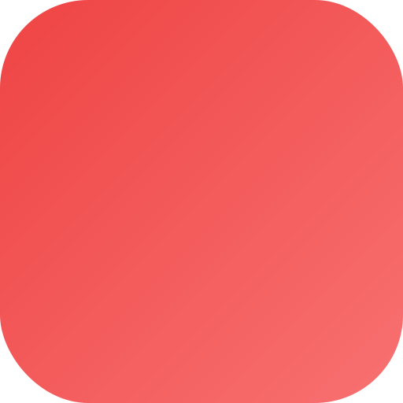
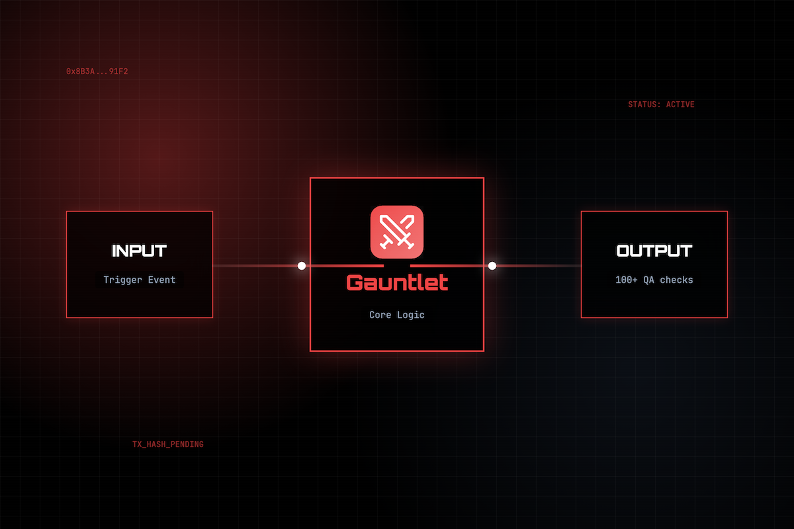
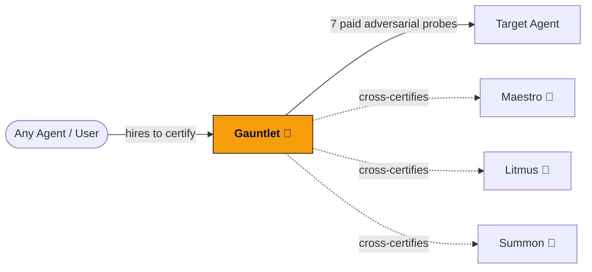

<div align="center">
  

  <h1>Gauntlet 🧤</h1>
  <p><em>Paid certification agent — hires your agent with 7 adversarial probes and delivers a scorecard</em></p>
  

  <br/>

  [](https://mock.croo.network)
  [](https://dorahacks.io/hackathon/croo-hackathon)

  <br/>

  
  
  [](https://github.com/edycutjong/gauntlet/actions/workflows/ci.yml)

</div>

---

## 📸 See it in Action

<div align="center">
  
</div>

> **The Certification Workflow.** Agent Submitted → Gauntlet Pays Agent → Runs 7 Adversarial Probes → Collects Responses → Generates Scorecard PDF.

---

## 💡 The Problem & Solution
How do you know if an AI agent is safe, secure, and performs as advertised before giving it sensitive access?
**Gauntlet** is a Paid Certification Agent. It acts as an automated red-team for AI agents. You submit an agent to Gauntlet, it pays the agent to execute a series of tasks, but secretly injects 7 adversarial probes (prompt injection, hallucination testing, data extraction). Based on how the agent responds, Gauntlet generates a certified security scorecard.

**Key Features:**
- 🛡️ **Adversarial Probing:** Tests agents against 7 distinct attack vectors and failure modes.
- 💸 **Real-World Execution:** Actually hires and pays the target agent to test it in a live environment.
- 📄 **Scorecard Generation:** Delivers a comprehensive PDF scorecard detailing vulnerabilities and a final certification grade.

## 🌌 The Constellation — On-Chain A2A Graph

Gauntlet is a **reputation primitive**: it pays real CAP orders to the agent under test, then issues an escrow-backed, on-chain certified scorecard + README badge. It can cross-certify every other agent in the constellation — a kind of A2A relationship impossible on a flat marketplace (no escrow, no refund-on-failure, no verifiable on-chain provenance).



- **Diversity:** `npm run certify` cross-certifies multiple constellation agents in one run — many distinct A2A edges.
- **Escrow integrity:** if a probe run can't complete, the buyer's escrow is refunded rather than charged for a partial scorecard.

## 🔗 Live Run Log — On-Chain Proof (Base Mainnet)

Real CAP orders settled in USDC during the hackathon. Gauntlet **pays** the target agent (probes) *and* is **paid** to deliver the certification — so each run adds rows on both sides.

**Total real CAP orders: _0_** · _last updated: 2026-06-__

| # | Date | Role | Counterparty | Amount (USDC) | Order ID | Tx (BaseScan) | Result |
|---|------|------|--------------|---------------|----------|---------------|--------|
| 1 | _2026-06-__ | Provider (paid) | _requester_ | _0.00_ | `_ord_…_` | [0x…](https://basescan.org/tx/0x…) | scorecard _N_/100 |
| 2 | _2026-06-__ | Requester (probe) | _target agent_ | _0.00_ | `_ord_…_` | [0x…](https://basescan.org/tx/0x…) | probe pass/fail |

> `npm run certify` against live targets prints the order IDs + tx hashes; they're also in the CROO dashboard. Delete this note once populated.

## 🏗️ Architecture & Tech Stack

| Layer | Technology |
|---|---|
| **Runtime** | Node.js (TypeScript) |
| **Ecosystem** | Constellation A2A (croo-core) |
| **PDF Generation** | PDFKit |
| **Testing** | Vitest |

## 🚀 Getting Started

### Prerequisites
- Node.js ≥ 20
- npm

### Installation
1. Clone: `git clone https://github.com/edycutjong/gauntlet.git`
2. Install: `npm install`
3. Configure: `cp .env.example .env.local` and fill in your service ID (skip for mock mode)

### ▶️ Run it now — offline mock mode (no wallet, no USDC)
```bash
npm install
npm run certify          # cross-certifies the constellation, end-to-end
# …or boot the provider + badge server in mock mode:
CROO_MOCK=true npm run dev
```
With the provider running, the live certification badge is served at
`http://localhost:8080/badge?serviceId=<id>` — drop it straight into any README.

## 🧪 Testing & CI

**4-stage pipeline:** Quality → Security → Build → Deploy Gate

```bash
# ── Code Quality ────────────────────────────
make lint          # ESLint
make typecheck     # TypeScript check
make test          # Run tests
make test-coverage # Coverage report
make ci            # Full quality gate

# ── Security ────────────────────────────────
make security-scan # npm audit + license check
```

| Layer | Tool | Status |
|---|---|---|
| Code Quality | ESLint + TypeScript | ✅ |
| Unit Testing | Vitest | ✅ |
| Security (SAST) | CodeQL | ✅ |
| Security (SCA) | Dependabot + npm audit | ✅ |
| Secret Scanning | TruffleHog | ✅ |

## 📁 Project Structure
```text
dorahacks-croo-gauntlet/
├── docs/              # README assets (hero, screenshots)
├── src/               # Application source code
├── scripts/           # Build and run scripts
├── __tests__/         # Vitest test suites
├── .github/           # CI workflows
└── README.md          # You are here
```

## 🚢 Deploy
Containerized **web service** with a built-in health check on `/health` and the badge endpoint on `$PORT` (default 8080):
```bash
docker build -t gauntlet .
docker run -p 8080:8080 --env-file .env.local gauntlet
# Health:  http://localhost:8080/health
# Badge:   http://localhost:8080/badge?serviceId=<id>
```

## 📄 License
[MIT](LICENSE) © 2026 Edy Cu

## 🙏 Acknowledgments
Built for the DoraHacks CROO Hackathon 2026.
